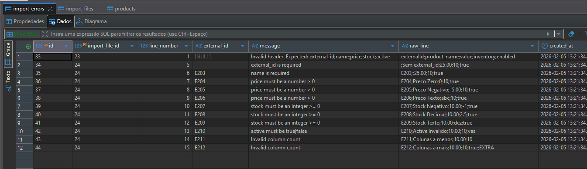
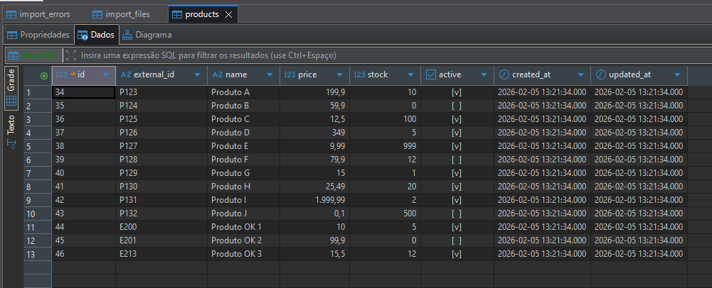

# Desafio — Serviço Interno de Importação de Produtos

Este projeto implementa um **worker de importação de produtos via CSV** que lê arquivos em `/imports/products` e persiste os dados no banco, lidando com:

- **Concorrência** (múltiplas instâncias em paralelo)
- **Idempotência** (arquivo e produto)
- **Falhas** (erros por linha e erros fatais por arquivo)
- **Processamento em lote** (batch upsert)

---

## Requisitos do desafio atendidos

### Worker periódico

- O worker é executado via: `php artisan products:import`
- Em produção, basta agendar esse comando a cada **10 minutos** (ex.: cron).

### Múltiplas instâncias em paralelo

- O “claim” de arquivos usa **PostgreSQL** com:
  - `FOR UPDATE SKIP LOCKED`
- Isso garante que **duas instâncias nunca processem o mesmo arquivo ao mesmo tempo**.

### Processamento seguro e idempotente

#### Idempotência de arquivo

- A tabela `import_files` controla o ciclo de vida do arquivo (`pending`, `processing`, `processed`, `error`).
- `file_path` é **único**: o mesmo arquivo não é “descoberto” duas vezes.
- Arquivos em `processed` **não são processados novamente**.

#### Idempotência de produto

- `products.external_id` é **único**.
- Importação usa `upsert` (insert/update) por `external_id`, então:
  - o mesmo produto pode aparecer em arquivos diferentes sem duplicar.

### Falhas

#### Erros

- Linhas inválidas são registradas em `import_errors` e o processamento continua.

#### Erros fatais

- Ex.: **header inválido** → marca o arquivo como `error` e salva `last_error`.

#### Reprocessamento

- Arquivos em `error` podem ser reprocessados em execuções futuras.
- Para evitar loop infinito com arquivo “quebrado para sempre”, foi aplicado **limite de tentativas** (`MAX_ATTEMPTS`).

### Processamento

- O parse é streaming e o `upsert` é feito em **lotes** (`batchSize=1000`), adequado para centenas de arquivos.

### Observabilidade

- Logs no Laravel (`Import started`, `Import finished`, `Import failed`)
- Tabelas de controle (`import_files`) e auditoria (`import_errors`)

---

## Decisões de arquitetura

### Responsabilidades

- **Worker**: orquestra o fluxo (descobrir → claim → processar → marcar status)
- **Repositories**:
  - `ImportFileRepository`: discover/claim/status
  - `ProductRepository`: upsert em lote
  - `ImportErrorRepository`: grava erros sem duplicar (firstOrCreate)
- **Parser**:
  - `CsvProductFileParser`: valida e mapeia linhas do CSV, gera batches

### `FOR UPDATE SKIP LOCKED`

É uma técnica do Postgres para **consumo concorrente** de “tarefas” (neste caso, arquivos a processar), permitindo N instâncias do worker sem conflitos.

### Priorização

Sem priorização, um arquivo permanentemente inválido em `error` poderia ser reprocessado infinitamente e **starvar** arquivos novos (`pending`).  
A query de claim ordena por status para priorizar **pending → error**.

---

## Estrutura (principais arquivos)

- `app/Console/Commands/ImportProductsCommand.php` — command `products:import`
- `app/Services/ProductImport/ProductImportWorker.php` — orquestrador
- `app/Services/ProductImport/CsvProductFileParser.php` — parser/validação/batches
- `app/DTOs/ProductImport/ParseResult.php` — DTO de resultado do parse
- `app/Repositories/ImportFileRepository.php` — discover/claim/status
- `app/Repositories/ProductRepository.php` — upsert em lote
- `app/Repositories/ImportErrorRepository.php` — registro de erros

---

## Como rodar

### Pré-requisitos

- Docker e Docker Compose

### 1) Subir containers

```bash
docker compose up -d db redis
```

### 2) Instalar dependências

```bash
docker compose run --rm app composer install
```

### 3) Configurar `.env`

```env
DB_CONNECTION=pgsql
DB_HOST=db
DB_PORT=5432
DB_DATABASE=product_importer
DB_USERNAME=app
DB_PASSWORD=app
```

### 4) Rodar migrations

```bash
docker compose run --rm app php artisan migrate
```

### 5) Executar o worker

```bash
docker compose run --rm app php artisan products:import
```

### 6) Executar testes unitários

```bash
docker compose run --rm app php artisan test --testsuite=Unit
```

---

## Exemplos de execução

### `import_files`


### `import_errors`



### `products`



---
